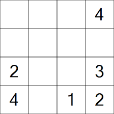
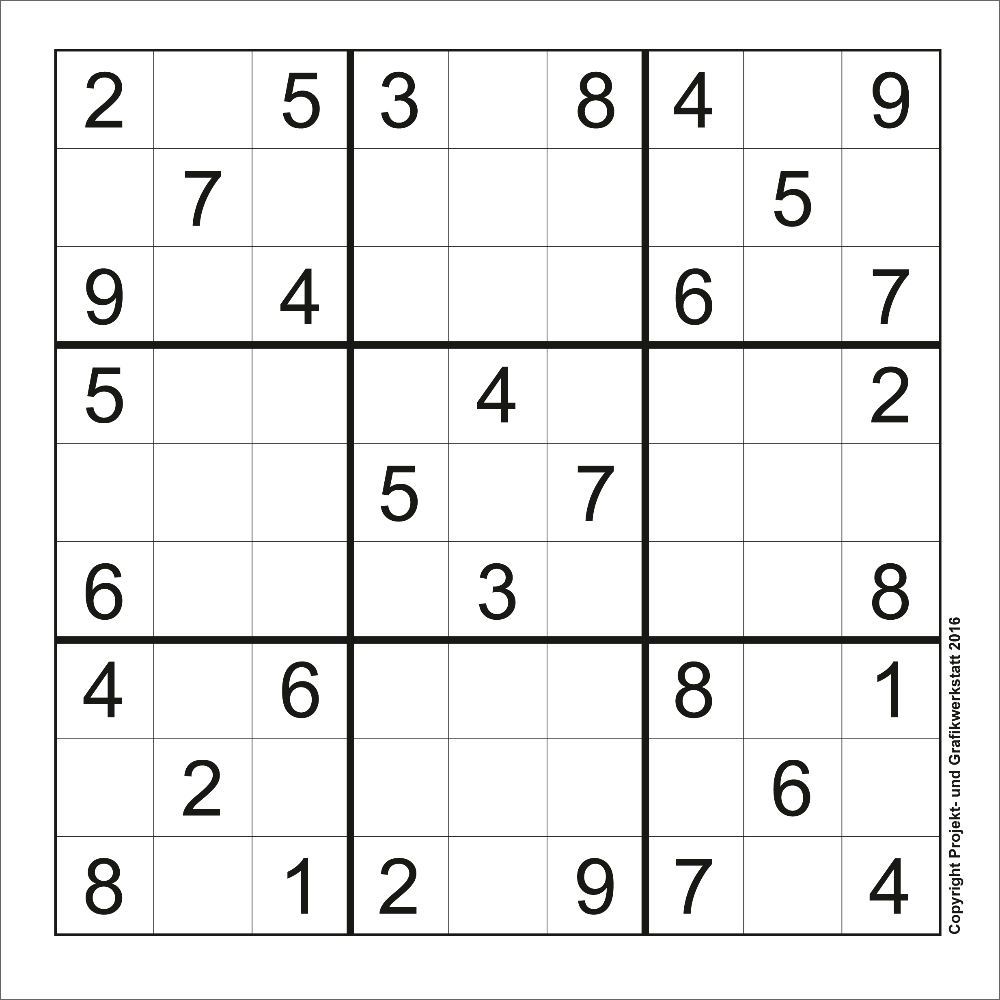
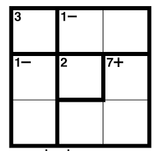
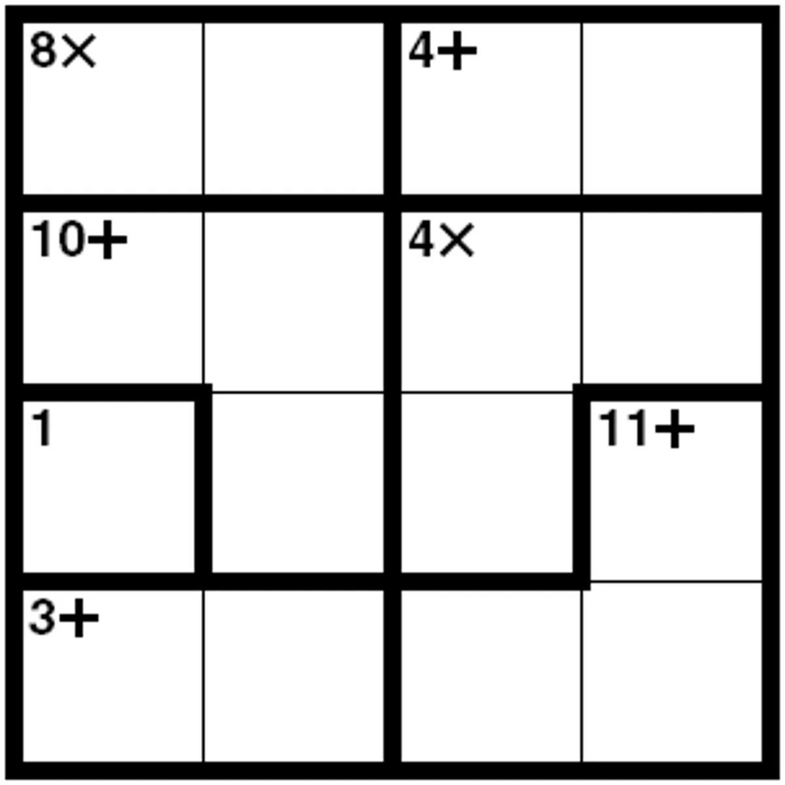
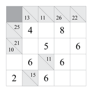
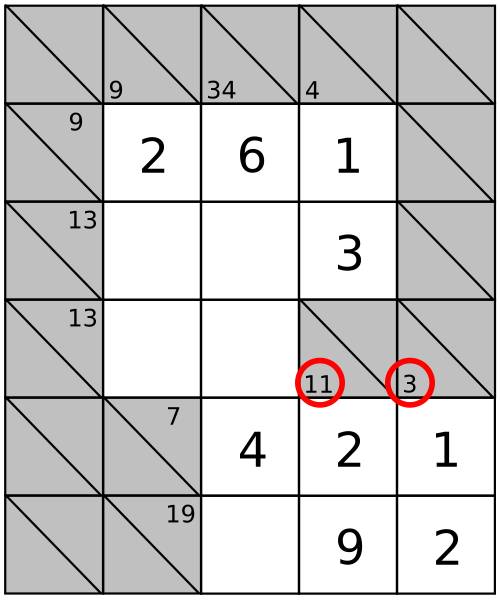
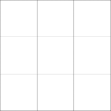

# Puzzles Matemáticos e Auto-avaliação

## Auto avaliação:

Desenha um círculo em turno dos números de 1 a 5.

|  Auto-avaliação   | 1 | 2 | 3 | 4 | 5 |
| ------- | --- | --- | --- | --- | --- |
| *Resultados nas fichas e provas* | 1 | 2 | 3 | 4 | 5 |
| *Prestar atenção nas Aulas* | 1 | 2 | 3 | 4 | 5 |
| *Fazer trabalhos de casa* | 1 | 2 | 3 | 4 | 5 |
| *Empenho na resolução de exercícios em aula* | 1 | 2 | 3 | 4 | 5 |
| **Nota final** | 1 | 2 | 3 | 4 | 5 |

---

## Melhorar 1% todos os dias

Se conseguires melhorar-te todos os dias 1% $(\frac{1}{100})$, o resultado acumulado no final de 1 ano (365 dias) é impressionante.

Sem esforço nem melhoria $1^{365} = 1$, mas com melhoria de 1% todos os dias fica $1,01^{365} = 37,78$ ou seja, 37 vezes maior.

---

## Desafio Sudoku

Instruções: todas as linhas, colunas e caixas têm os números de 1 a 4 ou de 1 a 9, sem nunca se repetirem.

&nbsp;&nbsp;&nbsp;&nbsp;&nbsp;&nbsp;&nbsp;&nbsp;&nbsp;&nbsp;

---

## Desafio KenKen

Cada linha e coluna tem os números de 1 a 3 ou 1 a 4 e cumpre as operações identificadas em cada caixa (a ordem é indiferente).

&nbsp;&nbsp;&nbsp;&nbsp;&nbsp;&nbsp;&nbsp;&nbsp;&nbsp;&nbsp;

---

## Desafio Kakuro

Preencher com números diferentes em todas as colunas e linhas mas que somem o valor indicado no topo da coluna ou no fim da linha.

&nbsp;&nbsp;&nbsp;&nbsp;&nbsp;&nbsp;&nbsp;&nbsp;&nbsp;&nbsp;

---

## Quadrado Mágico (PRO)

Colocar os números de 1 a 9 de modo a somar 15 nas linhas, colunas e diagonais.

